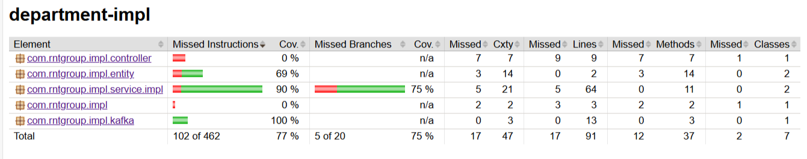

# CompanyMS Spring Boot Application

## Запуск приложения:

1. Используя СУБД PostgreSQL, создайте базы данных с названиями **department** и **employee**;
2. Впишите собственные значения для **POSTGRES_USER** и **POSTGRES_PASSWORD** в следующих файлах:
   - _docker-compose.yaml_;
   - _services\config-server\src\main\resources\configurations\department-service.yaml_;
   - _services\config-server\src\main\resources\configurations\employee-service.yaml_;
3. Откройте терминал в IntellijIDEA и напишите команду: _docker compose up -d_;
4. В случае успешного запуска всех docker-контейнеров в указанном порядке запустите микросервисы:
   - Run 'ConfigServerApplication';
   - Run 'DiscoveryApplication';
   - Run 'GatewayApplication';
   - Run 'EmployeeApplication';
   - Run 'DepartmentApplication'.

### Swagger:
Документация для следующих API:
   - Employee Microservice API: http://localhost:8070/swagger-ui/index.html
   - Department Microservice API: http://localhost:8060/swagger-ui/index.html

### Zipkin:
Инструмент для распределенного трассирования:
   - http://localhost:9411/zipkin/

### Postman:
В _resources_ приложен _company.postman_collection.json_ для тестирования API.

### Database:
Просмотр содержимого таблиц БД:

### Запуск интеграционных тестов:

1. Откройте терминал в IntellijIDEA и напишите команду: _docker compose up -d_;
2. В случае успешного запуска всех docker-контейнеров в указанном порядке запустите микросервисы:
   - Run 'ConfigServerApplication';
   - Run 'DiscoveryApplication';
   - Run 'GatewayApplication';
   - Run 'EmployeeApplication';
   - Run 'DepartmentApplication'.

Примечание: Если вы ранее использовали это приложение и вносили изменения в БД, то **рекомендуется перед запуском интеграционных тестов** очистить все таблицы, используя pgAdmin.

### Покрытие кода тестами (JaCoCo): 
1. department-service:
   
   
2. employee-service:
   
   